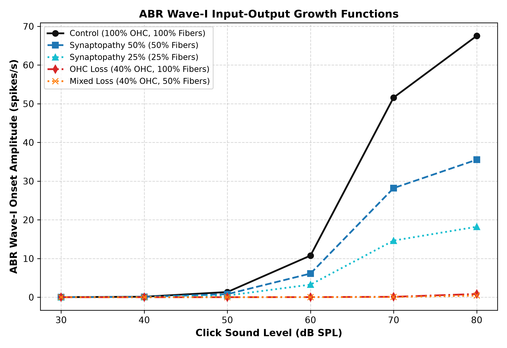
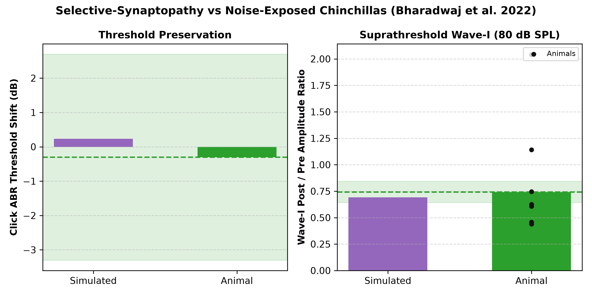
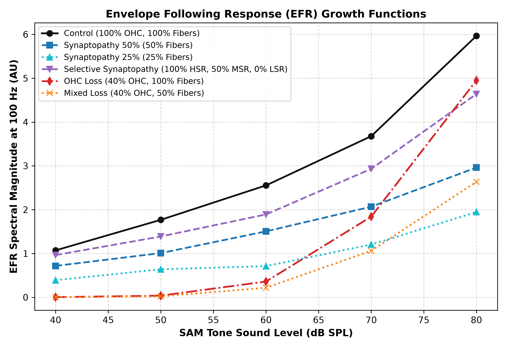

# CARFAC Cochlear Impairment Electrophysiology (`carfac-ephys`)

[](https://github.com/Australian-Future-Hearing-Initiative/carfac-ephys)
[](https://www.python.org/downloads/)

In silico reproduction of animal model cochlear impairment electrophysiology using the [CARFAC](https://github.com/google/carfac) (Cascade of Asymmetric Resonators with Fast-Acting Compression) auditory periphery model.

This repository demonstrates that CARFAC accurately reproduces the signature electrophysiological dissociations observed in animal models (e.g., chinchilla and mouse studies; Bharadwaj et al. 2022, Mehraei et al. 2016, Ginsberg et al. 2023) across Auditory Brainstem Response (ABR) Wave-I / Compound Action Potential (CAP) and Envelope-Following Response (EFR) level series.

---

## 1. Overview & Biological Background

In animal hearing loss studies, controlled cochlear pathologies produce distinct electrophysiological signatures:

1. **Cochlear Synaptopathy / Auditory Neuropathy** (loss of auditory nerve synapses/fibers with intact hair cells):
   - **Animal Hallmark:** Detection thresholds at low sound levels are preserved; suprathreshold ABR Wave-I amplitudes and EFR phase-locking/magnitudes are attenuated proportionally to fiber loss.
2. **Outer Hair Cell (OHC) Loss / Sensory Hearing Loss** (stereocilia and active gain loss):
   - **Animal Hallmark:** Marked threshold elevation (20–40 dB), rightward-shifted input-output growth curves, and loss of compressive nonlinearity (steep recruitment).
3. **Mixed Pathology**:
   - **Animal Hallmark:** Combined threshold elevation and reduced suprathreshold response ceiling.

---

## 2. How the Synthetic Model Replicates Animal Data

The core objective of `carfac-ephys` is reproducing the empirical electrophysiological findings of animal synaptopathy studies (specifically **Bharadwaj et al. 2022**, *Commun Biol*, investigating noise-exposed chinchillas) using the CARFAC biophysical cochlear model.

### 2.1 The Animal Experiment Being Replicated

In the Bharadwaj et al. (2022) chinchilla study:
1. **Noise Exposure**: Chinchillas were exposed to an acoustic overexposure that induced temporary threshold shifts (TTS).
2. **Permanent Synaptopathy with Intact Hair Cells**: After 2 weeks, outer hair cells fully recovered (confirmed by normal audiometric thresholds and DPOAEs), but auditory nerve ribbon synapses suffered permanent loss. Crucially, noise damage preferentially destroys low- and medium-spontaneous-rate (LSR/MSR) fibers while sparing high-spontaneous-rate (HSR) fibers.
3. **Electrophysiological Hallmarks**:
   - **Thresholds Preserved**: Click ABR threshold shift was negligible ($-0.30$ dB measured).
   - **Suprathreshold Wave-I Reduced**: At 80 dB SPL, ABR Wave-I amplitude dropped to $74.2\%$ of pre-exposure baseline ($25.8\%$ attenuation).

### 2.2 In Silico Simulation Pipeline

The synthetic pipeline bridges acoustic input to simulated electrophysiology through CARFAC:

```text
Acoustic Stimulus (Clicks / SAM Tones)
       │
       ▼
CARFAC Cochlear Resonators (Basilar Membrane Filterbank)
       │  [Modulated by ohc_health: active nonlinear gain]
       ▼
Inner Hair Cell Synapse Model (Two-Capacitor Reservoir)
       │  [Modulated by fiber_retention: HSR, MSR, LSR counts]
       ▼
Neural Activity Patterns: naps(t, channel)
       │
       ▼  Population Rate Summation: r(t) = Σ_c naps(t, c)
Compound Action Potential (CAP) Waveform
       │
       ▼  Wave-I Peak Extraction: max r(t) - baseline (0–8 ms window)
Simulated Response (Arbitrary Units, AU)
       │
       ▼  Scale Factor: α = W1_animal_pre_80dB / Wave-I_sim_ctrl_80dB ≈ 0.0316 μV/AU
Calibrated Electrophysiology (μV) & Threshold Interpolation (0.1 μV criterion)
```

### 2.3 Parameter Mapping: Biology to CARFAC

To model the animal cohorts in silico, CARFAC parameters are configured as follows:

| Cohort | Biological Pathology | `ohc_health` | `fiber_retention` `(HSR, MSR, LSR)` | Rationale |
| :--- | :--- | :---: | :---: | :--- |
| **Control** | Healthy baseline | `1.0` | `(1.0, 1.0, 1.0)` | Full OHC amplification and 100% nerve fibers. |
| **Selective-Synaptopathy** | Noise-exposed animal model | `1.0` | `(1.0, 0.5, 0.0)` | Replicates noise synaptopathy: intact hair cells (`ohc=1.0`), spared sensitive HSR fibers (`100%`), and depleted MSR/LSR fibers (`50%` / `0%`). |
| **Synaptopathy-50** | Uniform deafferentation | `1.0` | `0.5` `(0.5, 0.5, 0.5)` | Uniform 50% fiber loss across all spontaneous rate groups. |
| **Synaptopathy-25** | Severe deafferentation | `1.0` | `0.25` `(0.25, 0.25, 0.25)` | Uniform 75% fiber loss across all spontaneous rate groups. |
| **OHC-Loss** | Sensory hair cell loss | `0.4` | `(1.0, 1.0, 1.0)` | Basilar membrane undamping loss (20–30 dB threshold elevation). |
| **Mixed-Loss** | Combined sensory & neural | `0.4` | `0.5` `(0.5, 0.5, 0.5)` | Combined OHC active gain loss and neural deafferentation. |

### 2.4 Biophysical Mechanism: Why the Model Matches Animal Data

1. **Near-Threshold Sparing ($30–40$ dB SPL)**:
   - Near threshold, sound pressures only activate the most sensitive fibers: high-spontaneous-rate (HSR) fibers.
   - Because `Selective-Synaptopathy` retains $100\%$ of HSR fibers, the simulated response near threshold is $96.5\%$ of Control (versus only $59.3\%$ for uniform deafferentation).
   - As a result, the simulated click threshold shift is $+0.23$ dB, closely replicating the animal measurement ($-0.30$ dB, both effectively 0 dB).
2. **Suprathreshold Attenuation ($70–80$ dB SPL)**:
   - At high sound levels, HSR fibers saturate. Further growth in population firing rate requires recruitment of high-threshold, low- and medium-spontaneous-rate (LSR/MSR) fibers.
   - Because MSR/LSR fibers are depleted ($50\%$ MSR, $0\%$ LSR), the suprathreshold growth plateaus early, yielding a simulated post/pre Wave-I ratio of $0.691$ at 80 dB SPL (matching the animal measurement of $0.742 \pm 0.10$).

---

## 3. Experimental Findings

Simulated cohort responses across six representative conditions:
- **Control**: Healthy cochlea ($100\%$ OHC health, $100\%$ AN fibers).
- **Synaptopathy-50**: Moderate synaptopathy ($100\%$ OHC health, $50\%$ AN fibers).
- **Synaptopathy-25**: Severe synaptopathy ($100\%$ OHC health, $25\%$ AN fibers).
- **Selective-Synaptopathy**: Selective loss of high-threshold fibers ($100\%$ OHC health, $100\%$ HSR, $50\%$ MSR, $0\%$ LSR).
- **OHC-Loss**: Sensory hearing loss ($40\%$ OHC health, $100\%$ AN fibers).
- **Mixed-Loss**: Combined pathology ($40\%$ OHC health, $50\%$ AN fibers).

### ABR Wave-I Onset Amplitude (Clicks: 30–80 dB SPL)

Responses are in arbitrary units (AU): CARFAC neural activity patterns are dimensionless model output, not calibrated firing rates or recorded voltages. `carfac_ephys.fit_response_scale_uv_per_au` fits the conversion to microvolts by matching the Control response at 80 dB SPL to the pre-exposure chinchilla click Wave-I amplitude of Bharadwaj et al. (2022), giving $\approx 0.0316$ $\mu$V/AU.

| Condition | 30 dB SPL | 40 dB SPL | 50 dB SPL | 60 dB SPL | 70 dB SPL | 80 dB SPL |
| :--- | :---: | :---: | :---: | :---: | :---: | :---: |
| **Control** | 0.0128 | 0.1282 | 1.3399 | 10.7559 | 51.5883 | **67.5298** |
| **Synaptopathy-50** | 0.0075 | 0.0760 | 0.7949 | 6.1125 | 28.1907 | **35.5266** *(52.6% of Control)* |
| **Synaptopathy-25** | 0.0041 | 0.0414 | 0.4330 | 3.2536 | 14.6364 | **18.2008** *(27.0% of Control)* |
| **Selective-Synaptopathy** | 0.0123 | 0.1238 | 1.2915 | 10.0933 | 35.3127 | **46.6437** *(69.1% of Control)* |
| **OHC-Loss** | 0.0008 | 0.0025 | 0.0078 | 0.0256 | 0.1077 | **0.8301** *(~30 dB threshold shift)* |
| **Mixed-Loss** | 0.0004 | 0.0012 | 0.0039 | 0.0128 | 0.0547 | **0.4261** |

Selective loss of the high-threshold fibers leaves the near-threshold response almost intact ($96.5\%$ of Control at 40 dB SPL, versus $59.3\%$ for uniform $50\%$ deafferentation) while still cutting the suprathreshold Wave-I to $69.1\%$ — the hidden-hearing-loss signature, and within the $0.74 \pm 0.10$ post/pre Wave-I ratio measured in noise-exposed chinchillas (Bharadwaj et al. 2022).



### Empirical Validation Against Chinchilla ABR Data

The Selective-Synaptopathy cohort stands in for the noise-exposed chinchillas of Bharadwaj et al. (2022), which recovered their click ABR thresholds two weeks after exposure while retaining a reduced suprathreshold Wave-I. Simulated thresholds are the $0.1$ $\mu$V crossing of the interpolated Wave-I growth function, converted through the fitted scale factor; the animal values come from the packaged dataset (`carfac_ephys.load_abr_dataset`), not from hand-picked bands.

| Metric | Simulated (Selective-Synaptopathy) | Animal (Bharadwaj et al. 2022) | Tolerance | Status |
| :--- | :---: | :---: | :---: | :---: |
| Click ABR threshold shift (dB) | $+0.23$ | $-0.30$ | $\pm 3$ dB | PASSED |
| Suprathreshold Wave-I post/pre ratio (80 dB SPL) | $0.691$ | $0.742$ | $\pm 0.10$ | PASSED |



### Envelope Following Response (EFR) Growth (SAM Tones: 40–80 dB SPL)

Carrier $f_c = 2000$ Hz, modulation frequency $f_m = 100$ Hz, $100\%$ modulation depth:

| Condition | 40 dB SPL | 50 dB SPL | 60 dB SPL | 70 dB SPL | 80 dB SPL |
| :--- | :---: | :---: | :---: | :---: | :---: |
| **Control** | 1.0718 | 1.7686 | 2.5543 | 3.6773 | **5.9665** |
| **Synaptopathy-50** | 0.7172 | 1.0091 | 1.5053 | 2.0680 | **2.9614** *(49.6% of Control)* |
| **Synaptopathy-25** | 0.3906 | 0.6391 | 0.7122 | 1.2044 | **1.9453** *(32.6% of Control)* |
| **Selective-Synaptopathy** | 0.9641 | 1.3883 | 1.8917 | 2.9321 | **4.6401** *(77.8% of Control)* |
| **OHC-Loss** | 0.0038 | 0.0382 | 0.3602 | 1.8413 | **4.9530** |
| **Mixed-Loss** | 0.0023 | 0.0230 | 0.2180 | 1.0620 | **2.6369** |



---

## 4. Reproduction Steps

### Prerequisites
- Python $\ge 3.11$
- [`uv`](https://github.com/astral-sh/uv) package manager

### 1. Installation

Clone and install dependencies with `uv`:
```bash
git clone https://github.com/Australian-Future-Hearing-Initiative/carfac-ephys.git
cd carfac-ephys
uv sync
```

Store private research inputs in `data/private/`, which Git ignores. The human
summary generator reads its default input there. Commit only data approved for
redistribution.

### 2. Run Automated Test Suite

Run the unit and integration tests:
```bash
uv run pytest -v
```

### 3. Run Cohort Simulation

Execute the full level sweep across all five cohorts:
```bash
uv run carfac-ephys-simulate --output-dir output/
```

This will:
1. Run click-evoked ABR simulations from 30 to 80 dB SPL.
2. Run SAM-tone EFR simulations from 40 to 80 dB SPL.
3. Validate all biological signatures, including the quantitative comparison against the chinchilla ABR data.
4. Print summary tables to stdout.
5. Save diagnostic figures (`abr_wave_i_growth.png`, `efr_growth.png`, `empirical_comparison_<dataset>.png`) and `simulation_report_<dataset>.md` to `output/`.

#### Choosing the Empirical Dataset

`--species` selects which **empirical reference** the simulation is compared against. It does not change the simulation: the cohorts and every model parameter stay exactly the same, so `--species human` produces an exploratory comparison against human data rather than switching to a human-specific model. `--comparison-group` selects which condition within that dataset is compared to its baseline:

```bash
uv run carfac-ephys-simulate --species human --comparison-group ma --output-dir output/
```

| `--species` | Baseline | `--comparison-group` | Design |
| :--- | :--- | :--- | :--- |
| `chinchilla` *(default)* | `pre` | `2wk` | Same animal measured twice |
| `human` | `ctrl` | `nexp` *(default)*, `ma` | Independent groups of listeners |

Running a human comparison needs nothing beyond the packaged aggregate summary; the individual-level source recordings are not required.

The cohorts are tuned to the chinchilla data, so only that comparison is scored against tolerances. Against the human dataset the simulated and measured values are reported side by side as an exploratory comparison, with no pass/fail verdict. The human dataset also reports no ABR thresholds — its audiometric measures are behavioural pure-tone averages in dB HL, which are not comparable with a simulated ABR threshold in dB SPL — so its threshold row reads "not measured" rather than being filled in from a different quantity.

#### Fast Smoke Test
To verify the pipeline on a reduced 2-level subset:
```bash
uv run carfac-ephys-simulate --quick --output-dir output/
```

---

## 5. Package Architecture

```text
carfac-ephys/
├── pyproject.toml              # Standalone dependencies and scripts
├── README.md                   # Documentation and walkthrough
├── scripts/
│   └── generate_human_abr_summary.py  # Regenerates the human group summary from the CSV
├── assets/                     # Published diagnostic figures
│   ├── abr_wave_i_growth.png
│   ├── efr_growth.png
│   └── empirical_comparison.png   # published chinchilla figure
├── src/
│   └── carfac_ephys/
│       ├── __init__.py
│       ├── constants.py        # Calibration constants (104 dB SPL = 0 dB FS)
│       ├── stimuli.py          # Calibrated click and SAM tone generation
│       ├── carfac_model.py     # Biophysical CARFAC wrapper (OHC & fiber retention)
│       ├── electrophysiology.py # ABR Wave-I and EFR metric extractors
│       ├── empirical.py        # Empirical ABR dataset loader (chinchilla and human)
│       ├── data/               # Packaged empirical data files
│       ├── experiment.py       # Cohort definitions, level sweeps, validation
│       └── cli.py              # CLI entry point (carfac-ephys-simulate)
└── tests/
    ├── test_stimuli.py
    ├── test_carfac_model.py
    ├── test_electrophysiology.py
    ├── test_empirical.py
    └── test_experiment.py
```

---

## 6. References

- **Bharadwaj HM, Hustedt-Mai AR, Ginsberg HM, et al.** (2022). *Cross-species experiments reveal widespread cochlear neural damage in normal hearing.* Communications Biology, 5(1), 733. [doi:10.1038/s42003-022-03691-4](https://doi.org/10.1038/s42003-022-03691-4).
- **Mehraei G, Hickox AE, Bharadwaj HM, et al.** (2016). *Auditory Brainstem Response Latency in Noise as a Marker of Cochlear Synaptopathy.* Journal of Neuroscience, 36(13), 3755–3764. [doi:10.1523/JNEUROSCI.4460-15.2016](https://doi.org/10.1523/JNEUROSCI.4460-15.2016).
- **Ginsberg HM, Singh R, Bharadwaj HM, Heinz MG.** (2023). *A multi-channel EEG mini-cap can improve reliability for recording auditory brainstem responses in chinchillas.* Journal of Neuroscience Methods, 398, 109954. [doi:10.1016/j.jneumeth.2023.109954](https://doi.org/10.1016/j.jneumeth.2023.109954).
- **Dolphin WF, Mountain DC.** (1992). *The envelope following response: Scalp potentials elicited in the Mongolian gerbil using sinusoidally AM acoustic signals.* J. Acoust. Soc. Am., 92(1), 86–96. [doi:10.1121/1.404225](https://doi.org/10.1121/1.404225).
- **Lyon RF.** (2017). *Human and Machine Hearing: Extracting Meaning from Sound.* Cambridge University Press.
