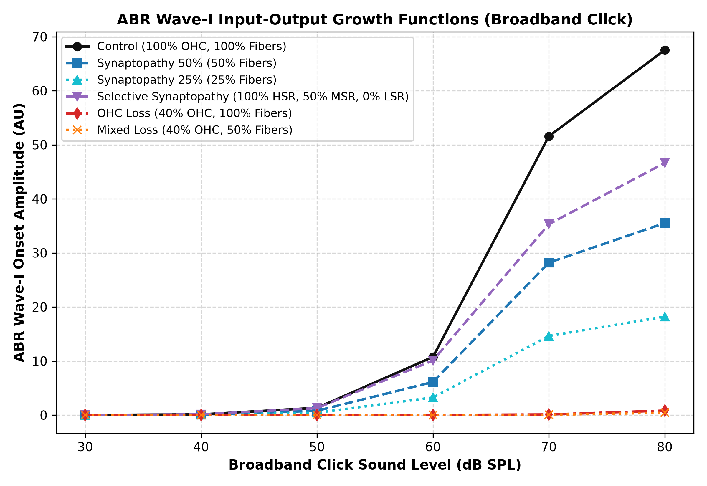
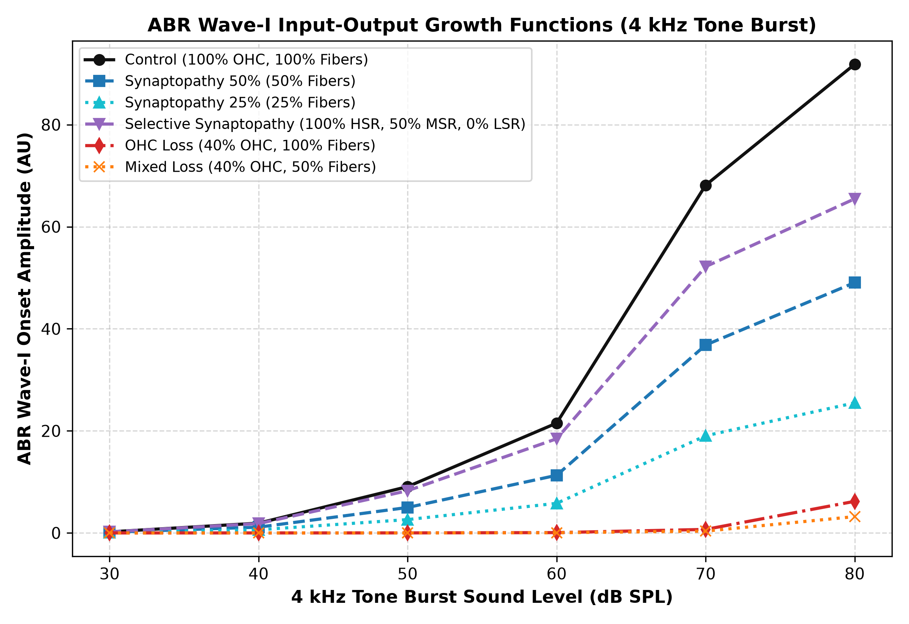
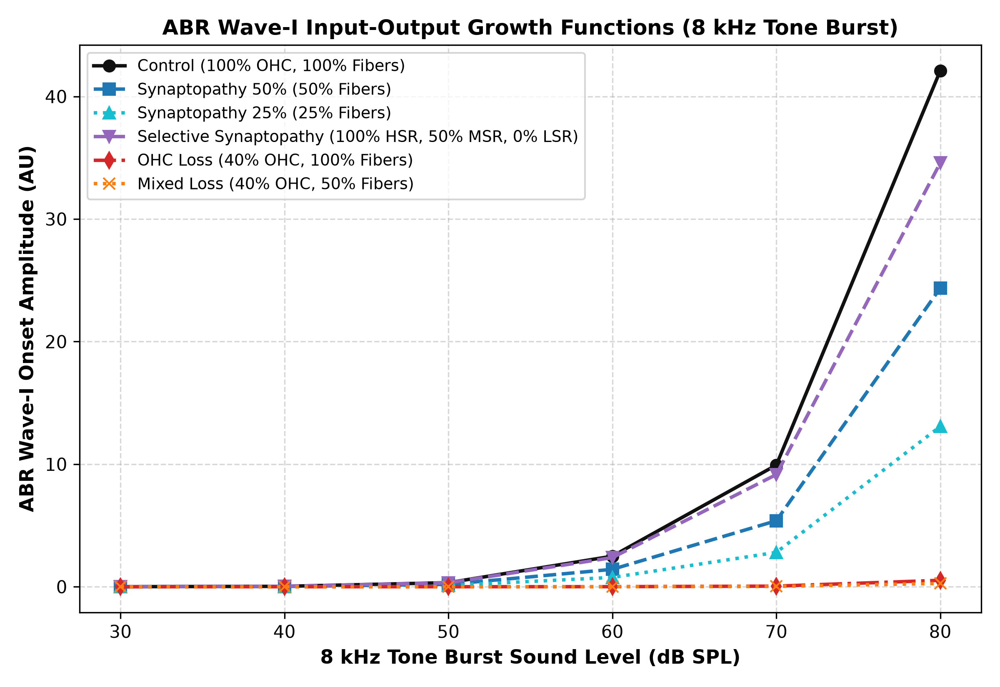
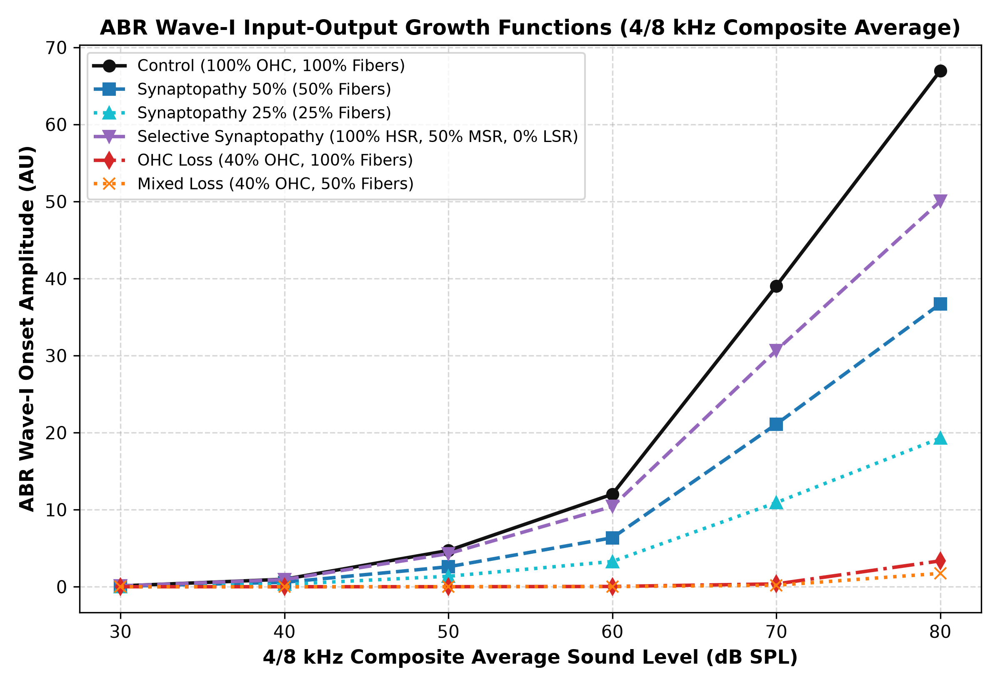
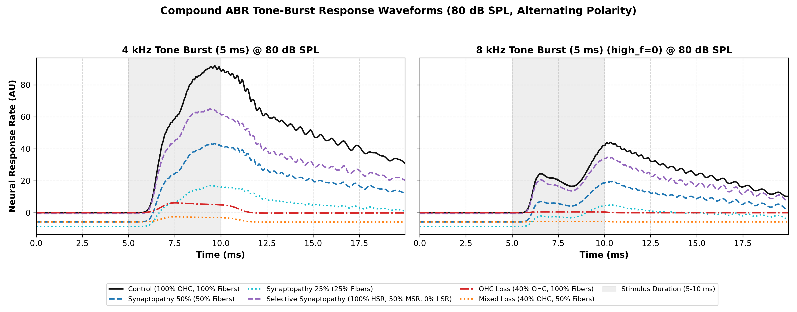

# CARFAC Cochlear Impairment Electrophysiology (`carfac-ephys`)

[](https://github.com/Australian-Future-Hearing-Initiative/carfac-ephys)
[](https://www.python.org/downloads/)

In silico reproduction of animal model cochlear impairment electrophysiology using the [CARFAC](https://github.com/google/carfac) (Cascade of Asymmetric Resonators with Fast-Acting Compression) auditory periphery model.

This repository demonstrates that CARFAC accurately reproduces the signature electrophysiological dissociations observed in animal models (e.g., chinchilla and mouse studies; Bharadwaj et al. 2022, Mehraei et al. 2016, Ginsberg et al. 2023) across Auditory Brainstem Response (ABR) Wave-I / Compound Action Potential (CAP) and Envelope-Following Response (EFR) level series.

---

## 1. Overview & Biological Background

In animal hearing loss studies, controlled cochlear pathologies produce distinct electrophysiological signatures:

1. **Cochlear Synaptopathy / Auditory Neuropathy** (loss of auditory nerve synapses/fibers with intact hair cells):
   - **Animal Hallmark:** Detection thresholds at low sound levels are preserved; suprathreshold ABR Wave-I amplitudes and EFR phase-locking/magnitudes are attenuated proportionally to fiber loss.
2. **Outer Hair Cell (OHC) Loss / Sensory Hearing Loss** (stereocilia and active gain loss):
   - **Animal Hallmark:** Marked threshold elevation (20–40 dB), rightward-shifted input-output growth curves, and loss of compressive nonlinearity (steep recruitment).
3. **Mixed Pathology**:
   - **Animal Hallmark:** Combined threshold elevation and reduced suprathreshold response ceiling.

---

## 2. How the Synthetic Model Replicates Animal Data

The core objective of `carfac-ephys` is reproducing the empirical electrophysiological findings of animal synaptopathy studies (specifically **Bharadwaj et al. 2022**, *Commun Biol*, investigating noise-exposed chinchillas) using the CARFAC biophysical cochlear model.

### 2.1 The Animal Experiment Being Replicated

In the Bharadwaj et al. (2022) chinchilla study:
1. **Noise Exposure**: Chinchillas were exposed to an acoustic overexposure that induced temporary threshold shifts (TTS).
2. **Permanent Synaptopathy with Intact Hair Cells**: After 2 weeks, outer hair cells fully recovered (confirmed by normal audiometric thresholds and DPOAEs), but auditory nerve ribbon synapses suffered permanent loss. Crucially, noise damage preferentially destroys low- and medium-spontaneous-rate (LSR/MSR) fibers while sparing high-spontaneous-rate (HSR) fibers.
3. **Electrophysiological Hallmarks**:
   - **Thresholds Preserved**: Click ABR threshold shift was negligible ($-0.30$ dB measured).
   - **Suprathreshold Wave-I Reduced**: At 80 dB SPL, ABR Wave-I amplitude dropped to $74.2\%$ of pre-exposure baseline ($25.8\%$ attenuation).

### 2.2 In Silico Simulation Pipeline

The synthetic pipeline bridges acoustic input to simulated electrophysiology through CARFAC:

```text
Acoustic Stimulus (Clicks / SAM Tones)
       │
       ▼
CARFAC Cochlear Resonators (Basilar Membrane Filterbank)
       │  [Modulated by ohc_health: active nonlinear gain]
       ▼
Inner Hair Cell Synapse Model (Two-Capacitor Reservoir)
       │  [Modulated by fiber_retention: HSR, MSR, LSR counts]
       ▼
Neural Activity Patterns: naps(t, channel)
       │
       ▼  Population Rate Summation: r(t) = Σ_c naps(t, c)
Compound Action Potential (CAP) Waveform
       │
       ▼  Wave-I Peak Extraction: max r(t) - baseline (0–8 ms window)
Simulated Response (Arbitrary Units, AU)
       │
       ▼  Scale Factor: α = W1_animal_pre_80dB / Wave-I_sim_ctrl_80dB ≈ 0.0316 μV/AU
Calibrated Electrophysiology (μV) & Threshold Interpolation (0.1 μV criterion)
```

### 2.3 Parameter Mapping: Biology to CARFAC

To model the animal cohorts in silico, CARFAC parameters are configured as follows:

| Cohort | Biological Pathology | `ohc_health` | `fiber_retention` `(HSR, MSR, LSR)` | Rationale |
| :--- | :--- | :---: | :---: | :--- |
| **Control** | Healthy baseline | `1.0` | `(1.0, 1.0, 1.0)` | Full OHC amplification and 100% nerve fibers. |
| **Selective-Synaptopathy** | Noise-exposed animal model | `1.0` | `(1.0, 0.5, 0.0)` | Replicates noise synaptopathy: intact hair cells (`ohc=1.0`), spared sensitive HSR fibers (`100%`), and depleted MSR/LSR fibers (`50%` / `0%`). |
| **Synaptopathy-50** | Uniform deafferentation | `1.0` | `0.5` `(0.5, 0.5, 0.5)` | Uniform 50% fiber loss across all spontaneous rate groups. |
| **Synaptopathy-25** | Severe deafferentation | `1.0` | `0.25` `(0.25, 0.25, 0.25)` | Uniform 75% fiber loss across all spontaneous rate groups. |
| **OHC-Loss** | Sensory hair cell loss | `0.4` | `(1.0, 1.0, 1.0)` | Basilar membrane undamping loss (20–30 dB threshold elevation). |
| **Mixed-Loss** | Combined sensory & neural | `0.4` | `0.5` `(0.5, 0.5, 0.5)` | Combined OHC active gain loss and neural deafferentation. |

### 2.4 Biophysical Mechanism: Why the Model Matches Animal Data

1. **Near-Threshold Sparing ($30–40$ dB SPL)**:
   - Near threshold, sound pressures only activate the most sensitive fibers: high-spontaneous-rate (HSR) fibers.
   - Because `Selective-Synaptopathy` retains $100\%$ of HSR fibers, the simulated response near threshold is $96.5\%$ of Control (versus only $59.3\%$ for uniform deafferentation).
   - As a result, the simulated click threshold shift is $+0.23$ dB, closely replicating the animal measurement ($-0.30$ dB, both effectively 0 dB).
2. **Suprathreshold Attenuation ($70–80$ dB SPL)**:
   - At high sound levels, HSR fibers saturate. Further growth in population firing rate requires recruitment of high-threshold, low- and medium-spontaneous-rate (LSR/MSR) fibers.
   - Because MSR/LSR fibers are depleted ($50\%$ MSR, $0\%$ LSR), the suprathreshold growth plateaus early, yielding a simulated post/pre Wave-I ratio of $0.691$ at 80 dB SPL (matching the animal measurement of $0.742 \pm 0.10$).

---

## 3. Experimental Findings

Simulated cohort responses across six representative conditions:
- **Control**: Healthy cochlea ($100\%$ OHC health, $100\%$ AN fibers).
- **Synaptopathy-50**: Moderate synaptopathy ($100\%$ OHC health, $50\%$ AN fibers).
- **Synaptopathy-25**: Severe synaptopathy ($100\%$ OHC health, $25\%$ AN fibers).
- **Selective-Synaptopathy**: Selective loss of high-threshold fibers ($100\%$ OHC health, $100\%$ HSR, $50\%$ MSR, $0\%$ LSR).
- **OHC-Loss**: Sensory hearing loss ($40\%$ OHC health, $100\%$ AN fibers).
- **Mixed-Loss**: Combined pathology ($40\%$ OHC health, $50\%$ AN fibers).

### 3.1 Broadband Click Data

#### ABR Wave-I Onset Amplitude (Broadband Clicks: 30–80 dB SPL)

Responses are in arbitrary units (AU): CARFAC neural activity patterns are dimensionless model output, not calibrated firing rates or recorded voltages. `carfac_ephys.fit_response_scale_uv_per_au` fits the conversion to microvolts by matching the Control response at 80 dB SPL to the pre-exposure chinchilla click Wave-I amplitude of Bharadwaj et al. (2022), giving $\approx 0.0316$ µV/AU.

| Condition | 30 dB SPL | 40 dB SPL | 50 dB SPL | 60 dB SPL | 70 dB SPL | 80 dB SPL |
| :--- | :---: | :---: | :---: | :---: | :---: | :---: |
| **Control** | 0.0128 | 0.1282 | 1.3399 | 10.7559 | 51.5884 | **67.5298** |
| **Synaptopathy-50** | 0.0075 | 0.0760 | 0.7949 | 6.1125 | 28.1906 | **35.5266** *(52.6% of Control)* |
| **Synaptopathy-25** | 0.0041 | 0.0414 | 0.4330 | 3.2536 | 14.6364 | **18.2007** *(27.0% of Control)* |
| **Selective-Synaptopathy** | 0.0123 | 0.1238 | 1.2915 | 10.0933 | 35.3128 | **46.6437** *(69.1% of Control)* |
| **OHC-Loss** | 0.0008 | 0.0025 | 0.0078 | 0.0256 | 0.1077 | **0.8301** *(~30 dB threshold shift)* |
| **Mixed-Loss** | 0.0004 | 0.0012 | 0.0039 | 0.0128 | 0.0547 | **0.4261** |

Selective loss of the high-threshold fibers leaves the near-threshold response almost intact ($96.5\%$ of Control at 40 dB SPL, versus $59.3\%$ for uniform $50\%$ deafferentation) while still cutting the suprathreshold Wave-I to $69.1\%$ — the hidden-hearing-loss signature, and within the $0.74 \pm 0.10$ post/pre Wave-I ratio measured in noise-exposed chinchillas (Bharadwaj et al. 2022).



#### Empirical Validation Against Chinchilla Click ABR Data

The Selective-Synaptopathy cohort stands in for the noise-exposed chinchillas of Bharadwaj et al. (2022), which recovered their click ABR thresholds two weeks after exposure while retaining a reduced suprathreshold Wave-I. Simulated thresholds are the $0.1$ µV crossing of the interpolated Wave-I growth function, converted through the fitted scale factor; the animal values come from the packaged dataset (`carfac_ephys.load_chinchilla_abr_dataset`), not from hand-picked bands.

| Metric | Simulated (Selective-Synaptopathy) | Animal (Bharadwaj et al. 2022) | Tolerance | Status |
| :--- | :---: | :---: | :---: | :---: |
| Click ABR threshold shift (dB) | $+0.23$ | $-0.30$ | $\pm 3$ dB | PASSED |
| Suprathreshold Wave-I post/pre ratio (80 dB SPL) | $0.691$ | $0.742$ | $\pm 0.10$ | PASSED |


---

### 3.2 Tone-Burst Data (4 kHz & 8 kHz)

Tone burst stimuli (5 ms duration, 0.5 ms linear rise/fall ramps, 20 Hz stimulation rate, 500 repetitions) are simulated across 30 to 80 dB SPL at 4 kHz and 8 kHz with alternating polarities ($+1.0$ and $-1.0$). Averaging the positive and negative polarity responses cancels the phase-locked cochlear microphonic (CM) and stimulus artifact, isolating the rectified neural compound action potential (Wave-I).

#### 4 kHz Tone-Burst ABR Wave-I (30–80 dB SPL)
Under the default **mode-dependent** strategy (reference: `average`), tone bursts share the composite 4/8 kHz average scale factor ($\approx 0.0184$ µV/AU). Under an `individual` calibration strategy, matching the Control 4 kHz response at 80 dB SPL to the animal 4 kHz pre-exposure baseline ($1.3685$ µV) yields $\approx 0.0149$ µV/AU.

| Condition | 30 dB SPL | 40 dB SPL | 50 dB SPL | 60 dB SPL | 70 dB SPL | 80 dB SPL |
| :--- | :---: | :---: | :---: | :---: | :---: | :---: |
| **Control** | 0.2096 | 1.9149 | 9.0726 | 21.5176 | 68.1508 | **91.8332** |
| **Synaptopathy-50** | 0.1284 | 1.1333 | 4.9877 | 11.2915 | 36.8242 | **49.0532** *(53.4% of Control)* |
| **Synaptopathy-25** | 0.0711 | 0.6168 | 2.6129 | 5.7994 | 19.0367 | **25.4909** *(27.8% of Control)* |
| **Selective-Synaptopathy** | 0.2029 | 1.8334 | 8.2708 | 18.4511 | 52.1874 | **65.4712** *(71.3% of Control)* |
| **OHC-Loss** | 0.0001 | 0.0006 | 0.0065 | 0.0655 | 0.6876 | **6.1919** *(~30 dB threshold shift)* |
| **Mixed-Loss** | 0.0000 | 0.0003 | 0.0034 | 0.0339 | 0.3567 | **3.1971** |



#### 8 kHz Tone-Burst ABR Wave-I (30–80 dB SPL, high_f=0)
Under the default **mode-dependent** strategy (reference: `average`), tone bursts share the composite 4/8 kHz average scale factor ($\approx 0.0184$ µV/AU). Under an `individual` calibration strategy, matching the Control 8 kHz response at 80 dB SPL to the animal 8 kHz pre-exposure baseline ($1.0985$ µV) yields $\approx 0.0261$ µV/AU.

> [!NOTE]
> CARFAC's `high_f_factor` parameter (`default: 0.0`) adjusts the pole distribution and damping for channels near Nyquist ($>4$ kHz) relative to $f_s$, allowing fine-tuning of 8 kHz tone-burst sensitivity relative to 4 kHz. The title reflects the active factor (e.g. `8 kHz Tone Burst (high_f=0)`).

| Condition | 30 dB SPL | 40 dB SPL | 50 dB SPL | 60 dB SPL | 70 dB SPL | 80 dB SPL |
| :--- | :---: | :---: | :---: | :---: | :---: | :---: |
| **Control** | 0.0033 | 0.0330 | 0.3328 | 2.4910 | 9.9253 | **42.0962** |
| **Synaptopathy-50** | 0.0019 | 0.0193 | 0.1939 | 1.4197 | 5.3846 | **24.3663** *(57.9% of Control)* |
| **Synaptopathy-25** | 0.0011 | 0.0107 | 0.1047 | 0.7580 | 2.8019 | **13.0749** *(31.1% of Control)* |
| **Selective-Synaptopathy** | 0.0032 | 0.0319 | 0.3207 | 2.3775 | 9.1512 | **34.5782** *(82.1% of Control)* |
| **OHC-Loss** | 0.0000 | 0.0000 | 0.0005 | 0.0050 | 0.0501 | **0.5234** *(~30 dB threshold shift)* |
| **Mixed-Loss** | 0.0000 | 0.0000 | 0.0003 | 0.0025 | 0.0256 | **0.2679** |



#### 4/8 kHz Composite Average ABR Wave-I (30–80 dB SPL)
Matches the Control composite response at 80 dB SPL to the animal 4/8 kHz composite baseline ($1.2335$ µV), providing the shared tone-burst scale factor of $\approx 0.0184$ µV/AU used under the default **mode-dependent** strategy.

| Condition | 30 dB SPL | 40 dB SPL | 50 dB SPL | 60 dB SPL | 70 dB SPL | 80 dB SPL |
| :--- | :---: | :---: | :---: | :---: | :---: | :---: |
| **Control** | 0.1065 | 0.9740 | 4.7027 | 12.0043 | 39.0380 | **66.9647** |
| **Synaptopathy-50** | 0.0651 | 0.5763 | 2.5908 | 6.3556 | 21.1044 | **36.7098** *(54.8% of Control)* |
| **Synaptopathy-25** | 0.0361 | 0.3138 | 1.3588 | 3.2787 | 10.9193 | **19.2829** *(28.8% of Control)* |
| **Selective-Synaptopathy** | 0.1030 | 0.9326 | 4.2957 | 10.4143 | 30.6693 | **50.0247** *(74.7% of Control)* |
| **OHC-Loss** | 0.0000 | 0.0003 | 0.0035 | 0.0352 | 0.3688 | **3.3576** |
| **Mixed-Loss** | 0.0000 | 0.0002 | 0.0018 | 0.0182 | 0.1912 | **1.7325** |



#### Tone-Burst Response Waveforms at 80 dB SPL
Side-by-side horizontal response waveforms (4 kHz and 8 kHz at 80 dB SPL) over a 20 ms window (5 ms pre-stimulus baseline, 5 ms tone-burst stimulus from 5–10 ms highlighted in gray) demonstrating the compound neural onset response and subsequent adaptation:



#### Tone-Burst Empirical Validation Against Chinchilla Data
Simulated threshold shifts ($0.1$ µV criterion under the default **mode-dependent** calibration with `average` reference) and suprathreshold post/pre ratios from the `Selective-Synaptopathy` cohort compared against noise-exposed chinchilla tone-burst measurements from Bharadwaj et al. (2022):

| Metric | Simulated (Selective-Synaptopathy) | Animal (Bharadwaj et al. 2022) | Tolerance | Status |
| :--- | :---: | :---: | :---: | :---: |
| Tone-Burst 4000 Hz ABR threshold shift (dB) | $+0.51$ | $+1.61$ | $\pm 3$ dB | PASSED |
| Tone-Burst 4000 Hz Wave-I ratio (80 dB SPL) | $0.713$ | $0.626$ | $\pm 0.10$ | PASSED |
| Tone-Burst 8000 Hz ABR threshold shift (dB) | $+0.49$ | $+2.08$ | $\pm 3$ dB | PASSED |
| Tone-Burst 8000 Hz Wave-I ratio (80 dB SPL) | $0.821$ | $0.831$ | $\pm 0.10$ | PASSED |
| Tone-Burst 4/8 kHz average ABR threshold shift (dB) | $+1.11$ | $+1.84$ | $\pm 3$ dB | PASSED |
| Tone-Burst 4/8 kHz average Wave-I ratio (80 dB SPL) | $0.747$ | $0.717$ | $\pm 0.10$ | PASSED |

---

### 3.3 Envelope Following Response (EFR) Growth (SAM Tones: 40–80 dB SPL)

Carrier $f_c = 2000$ Hz, modulation frequency $f_m = 100$ Hz, $100\%$ modulation depth:

| Condition | 40 dB SPL | 50 dB SPL | 60 dB SPL | 70 dB SPL | 80 dB SPL |
| :--- | :---: | :---: | :---: | :---: | :---: |
| **Control** | 1.0718 | 1.7686 | 2.5543 | 3.6773 | **5.9665** |
| **Synaptopathy-50** | 0.7172 | 1.0091 | 1.5053 | 2.0680 | **2.9614** *(49.6% of Control)* |
| **Synaptopathy-25** | 0.3906 | 0.6391 | 0.7122 | 1.2044 | **1.9453** *(32.6% of Control)* |
| **Selective-Synaptopathy** | 0.9641 | 1.3883 | 1.8917 | 2.9321 | **4.6401** *(77.8% of Control)* |
| **OHC-Loss** | 0.0038 | 0.0382 | 0.3602 | 1.8413 | **4.9530** |
| **Mixed-Loss** | 0.0023 | 0.0230 | 0.2180 | 1.0620 | **2.6369** |


---

### 3.4 Calibration Strategies (AU to µV Scaling)

`carfac-ephys` supports three distinct calibration strategies to convert arbitrary response units (AU) to physical microvolts (µV) matching empirical chinchilla recordings:

1. **`mode-dependent` (Default)**:
   Broadband clicks use their dedicated click calibration factor ($\approx 0.0316$ µV/AU), while tone-bursts share a **single common scale factor** determined by `--calibration-reference` (default: `average`, $\approx 0.0184$ µV/AU; or optionally `4k` or `8k`). This preserves relative frequency sensitivity between 4 kHz and 8 kHz tone bursts while accounting for spectral differences against broadband clicks.

2. **`individual`**:
   Every stimulus mode and frequency is scaled to its **own** 80 dB pre-exposure amplitude from the empirical chinchilla dataset (Bharadwaj et al. 2022).
   - Click scale factor: $\approx 0.0316$ µV/AU
   - 4 kHz tone-burst scale factor: $\approx 0.0149$ µV/AU
   - 8 kHz tone-burst scale factor: $\approx 0.0261$ µV/AU
   - 4/8 kHz composite average scale factor: $\approx 0.0184$ µV/AU

3. **`unified`**:
   A **single universal scale factor** is applied across all stimuli (clicks and tone bursts alike), determined by `--calibration-reference` (default: `average`, or optionally `click`, `4k`, or `8k`).

Threshold shift evaluation ($0.1$ µV criterion) scales directly with the chosen strategy, while suprathreshold post/pre ratios ($A_{\text{exposed}} / A_{\text{control}}$) are scale-invariant.

---

## 4. Reproduction Steps

### Prerequisites
- Python $\ge 3.11$
- [`uv`](https://github.com/astral-sh/uv) package manager

### 1. Installation

Clone and install dependencies with `uv`:
```bash
git clone https://github.com/Australian-Future-Hearing-Initiative/carfac-ephys.git
cd carfac-ephys
uv sync
```

### 2. Run Automated Test Suite

Verify all 175 unit and integration tests:
```bash
uv run pytest -v
```

#### 3. Run Cohort Simulation (CLI Examples)

The `carfac-ephys-simulate` CLI tool provides comprehensive configuration flags:

#### Full Diagnostic Suite (Default)
Run all 6 cohorts across click ABR, SAM tone EFR, and 4/8 kHz tone bursts using the default **mode-dependent** calibration (average reference):
```bash
uv run carfac-ephys-simulate --output-dir output/ --stimulus all
```

#### Stimulus-Specific Sweeps
Run simulations targeted to a specific stimulus modality:
```bash
# Broadband click ABR and SAM tone EFR simulations only
uv run carfac-ephys-simulate --output-dir output_clicks/ --stimulus click

# 4 kHz and 8 kHz alternating-polarity tone-burst simulations only
uv run carfac-ephys-simulate --output-dir output_tone_bursts/ --stimulus tone-burst
```

#### Calibration Strategy Comparisons
Explore how different scaling assumptions affect microvolt conversion and threshold shift estimation:
```bash
# 1. Mode-dependent with composite average reference (Default)
#    Clicks scale to click peak (~0.0316 µV/AU); tone-bursts share the 4/8 kHz average (~0.0184 µV/AU)
uv run carfac-ephys-simulate --calibration-strategy mode-dependent --calibration-reference average

# 2. Mode-dependent with 4 kHz reference (tone-bursts share the 4 kHz factor, ~0.0149 µV/AU)
uv run carfac-ephys-simulate --calibration-strategy mode-dependent --calibration-reference 4k

# 3. Individual calibration (every stimulus scales to its own 80 dB pre-exposure amplitude)
uv run carfac-ephys-simulate --calibration-strategy individual

# 4. Unified universal calibration (single factor across all stimuli, e.g. click reference)
uv run carfac-ephys-simulate --calibration-strategy unified --calibration-reference click
```

#### High-Frequency Tuning with `high_f_factor`
Adjust CARFAC high-frequency filter distribution and damping for channels $>4$ kHz:
```bash
# Fine-tune 8 kHz sensitivity relative to 4 kHz
uv run carfac-ephys-simulate --stimulus tone-burst --high-f-factor 4.0 --output-dir output_high_f/
```

#### Fast Smoke Testing & Headless Runs
```bash
# Fast 2-level sweep (60 and 80 dB SPL) to quickly test pipeline execution
uv run carfac-ephys-simulate --quick --output-dir output_quick/

# Headless / CI simulation without generating PNG figures (ASCII tables & metrics only)
uv run carfac-ephys-simulate --quick --no-plot
```

---

### 4. Python API Usage

Simulations, calibrations, and metric evaluations can be directly scripted in Python:

#### Example 1: Multi-Frequency Tone Bursts with Calibration & Validation
```python
import carfac_ephys as ce

# 1. Multi-frequency tone-burst cohort simulation (30 to 80 dB SPL)
tb_results = ce.simulate_tone_burst_cohort(
    tone_burst_levels_db=[30.0, 40.0, 50.0, 60.0, 70.0, 80.0],
    high_f_factor=0.0,
)

# 2. Resolve fitted scale factors (mode-dependent with average reference)
scale_avg = ce.resolve_scale_factor(
    strategy="mode-dependent",
    stimulus_type="average",
    tone_burst_results=tb_results,
    reference="average",
)
print(f"Fitted tone-burst scale factor: {scale_avg:.4g} µV/AU")

# 3. Quantitative empirical comparison against chinchilla data (Bharadwaj et al. 2022)
tb_comp = ce.compare_tone_burst_to_empirical(
    tone_burst_results=tb_results,
    calibration_strategy="mode-dependent",
    calibration_reference="average",
)
print("\n" + ce.format_tone_burst_comparison_table(tb_comp))

# 4. Save 3-panel composite and individual growth figures
ce.plot_tone_burst_growth(tb_results, "output/abr_wave_i_growth_tone_burst.png")
ce.plot_tone_burst_individual_growth(tb_results, "output/")
```

#### Example 2: Broadband Click ABR and SAM Tone EFR
```python
import carfac_ephys as ce

# 1. Run click-evoked ABR and SAM-tone EFR sweeps across default cohorts
click_levels = [30.0, 40.0, 50.0, 60.0, 70.0, 80.0]
abr_results = ce.simulate_abr_level_series(click_levels_db=click_levels)
efr_results = ce.simulate_efr_level_series(efr_levels_db=[40.0, 50.0, 60.0, 70.0, 80.0])

# 2. Evaluate click threshold shifts and suprathreshold Wave-I attenuation
comparison = ce.compare_to_empirical(click_levels, abr_results)
print(ce.format_empirical_comparison_table(comparison))

# 3. Plot growth curves and save full Markdown simulation report
ce.plot_abr_growth(click_levels, abr_results, "output/abr_wave_i_growth_click.png", stimulus_label="Broadband Click")
ce.plot_efr_growth([40.0, 50.0, 60.0, 70.0, 80.0], efr_results, "output/efr_growth.png")
ce.generate_simulation_report(click_levels, abr_results, [40.0, 50.0, 60.0, 70.0, 80.0], efr_results, "output/simulation_report.md")
```

#### Example 3: Side-by-Side Waveforms with High-Frequency Tuning
```python
import carfac_ephys as ce

# Simulate 80 dB SPL population response waveforms with custom high-frequency damping
high_f = 0.25
waveforms_4k = ce.simulate_tone_burst_waveforms(frequency_hz=4000.0, level_db=80.0, high_f_factor=high_f)
waveforms_8k = ce.simulate_tone_burst_waveforms(frequency_hz=8000.0, level_db=80.0, high_f_factor=high_f)

# Plot side-by-side waveforms with constrained legend and annotated 8 kHz title
ce.plot_tone_burst_waveforms(
    waveforms_4k,
    waveforms_8k,
    output_path="output/tone_burst_waveforms.png",
    level_db=80.0,
    high_f_factor=high_f,
)
```

#### Example 4: Custom Cohort Conditions and Threshold Shift Extraction
```python
import carfac_ephys as ce

# Define custom cochlear conditions with specified OHC health and auditory nerve fiber retention
custom_cohort = {
    "Control": ce.CohortCondition("Control", ohc_health=1.0, fiber_retention=1.0),
    "Moderate-Synaptopathy": ce.CohortCondition("Moderate-Synaptopathy", ohc_health=1.0, fiber_retention=0.40),
    "Partial-OHC-Loss": ce.CohortCondition("Partial-OHC-Loss", ohc_health=0.60, fiber_retention=1.0),
}

levels = [30.0, 40.0, 50.0, 60.0, 70.0, 80.0]
results = ce.simulate_abr_level_series(cohort=custom_cohort, click_levels_db=levels)

# Calculate threshold in dB SPL for a 0.1 µV criterion
scale = ce.fit_response_scale_uv_per_au(levels, results, condition="Control")
criterion_au = 0.1 / scale

ctrl_thresh = ce.estimate_threshold_db(levels, results["Control"], criterion_au)
mod_thresh = ce.estimate_threshold_db(levels, results["Moderate-Synaptopathy"], criterion_au)
print(f"Moderate synaptopathy threshold shift: {mod_thresh - ctrl_thresh:+.2f} dB")
```

---

## 5. Package Architecture

```text
carfac-ephys/
├── pyproject.toml              # Standalone dependencies and scripts
├── README.md                   # Documentation and walkthrough
├── assets/                     # Published diagnostic figures
│   ├── abr_wave_i_growth.png
│   ├── abr_wave_i_growth_click.png
│   ├── abr_wave_i_growth_4k.png
│   ├── abr_wave_i_growth_8k.png
│   ├── abr_wave_i_growth_avg.png
│   ├── abr_wave_i_growth_tone_burst.png
│   ├── tone_burst_waveforms.png
│   ├── efr_growth.png
│   ├── empirical_comparison.png
│   └── simulation_report.md
├── src/
│   └── carfac_ephys/
│       ├── __init__.py
│       ├── constants.py        # Calibration constants (104 dB SPL = 0 dB FS)
│       ├── stimuli.py          # Calibrated click, SAM tone, and tone-burst generation
│       ├── carfac_model.py     # Biophysical CARFAC wrapper (OHC & fiber retention, high_f_factor)
│       ├── electrophysiology.py # ABR Wave-I and EFR metric extractors
│       ├── empirical.py        # Chinchilla ABR dataset loader (Bharadwaj et al. 2022)
│       ├── data/               # Packaged empirical data files
│       ├── experiment.py       # Cohort definitions, level sweeps, calibration strategies, validation
│       └── cli.py              # CLI entry point (carfac-ephys-simulate)
└── tests/
    ├── test_stimuli.py
    ├── test_carfac_model.py
    ├── test_electrophysiology.py
    ├── test_empirical.py
    └── test_experiment.py
```

---

## 6. References

- **Bharadwaj HM, Hustedt-Mai AR, Ginsberg HM, et al.** (2022). *Cross-species experiments reveal widespread cochlear neural damage in normal hearing.* Communications Biology, 5(1), 733. [doi:10.1038/s42003-022-03691-4](https://doi.org/10.1038/s42003-022-03691-4).
- **Mehraei G, Hickox AE, Bharadwaj HM, et al.** (2016). *Auditory Brainstem Response Latency in Noise as a Marker of Cochlear Synaptopathy.* Journal of Neuroscience, 36(13), 3755–3764. [doi:10.1523/JNEUROSCI.4460-15.2016](https://doi.org/10.1523/JNEUROSCI.4460-15.2016).
- **Ginsberg HM, Singh R, Bharadwaj HM, Heinz MG.** (2023). *A multi-channel EEG mini-cap can improve reliability for recording auditory brainstem responses in chinchillas.* Journal of Neuroscience Methods, 398, 109954. [doi:10.1016/j.jneumeth.2023.109954](https://doi.org/10.1016/j.jneumeth.2023.109954).
- **Dolphin WF, Mountain DC.** (1992). *The envelope following response: Scalp potentials elicited in the Mongolian gerbil using sinusoidally AM acoustic signals.* J. Acoust. Soc. Am., 92(1), 86–96. [doi:10.1121/1.404225](https://doi.org/10.1121/1.404225).
- **Lyon RF.** (2017). *Human and Machine Hearing: Extracting Meaning from Sound.* Cambridge University Press.
